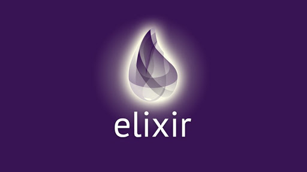

# Rocketseat's Elixir Ignite Bootcamp

This repository groups the projects developed in Rocketseat's Elixir Ignite Bootcamp.

  

Build distibuted applications, escalable and fault tolerant, using functional
programming.

## Elixir Fundamentals

In this module we will get to know Elixir and understand the main language concepts, how: immutability, pattern matching and pipe operator.
In addition, we build our first project.

## Challenge: Using Recursion

In this challenge, you must create a function that recursively calculates through a list of numbers, how the elements are in the list and returns the value.

## Challenge: Filtering Lists

In this challenge you must create a new project with a function that given a list of strings that represents numbers or not, filter all numerics elements and returns the odd elements are in the list.
